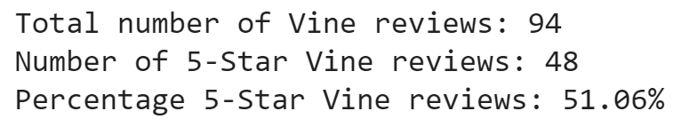
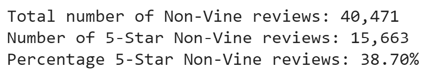

# Overview
The purpose of this project is to analyze Amazon reviews for video games.
The reviews were given by members, both the paid Amazon Vine program, and general members. 
The analysis presented is to determine whether reviews display positivity bias.

# Results
After analyzing the data, following results were inferred;

# Summary
Reviewing the results, it occurs that the members of the Vine program are more likely to give positive reviews. 
